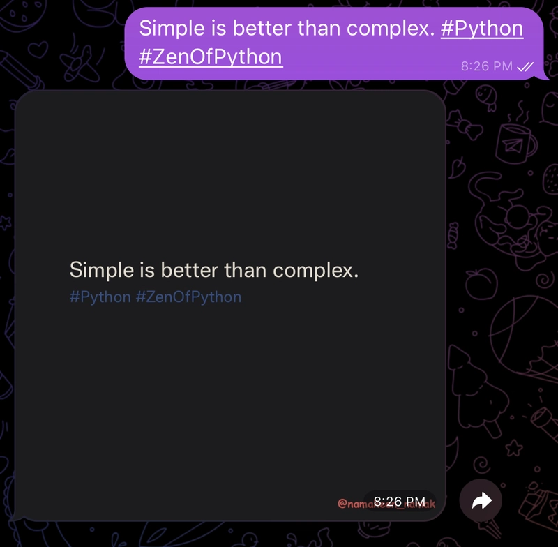

In today's fast-paced digital world, creating engaging content is a top priority for individuals and businesses alike. Imagine being able to generate aesthetically pleasing images from text messages, complete with hashtags and custom watermarks, right from Telegram. Let me introduce you to a Telegram bot that makes this a breeze!

In this article, I'll walk you through how this bot works, its use cases, and how you can set it up in just a few steps.

## What Does This Bot Do?

This bot takes text input from Telegram users and generates visually appealing images with:

* Rich text formatting
* Custom hashtags
* Watermarks (like your brand or username)

The generated images can be saved locally or shared instantly, perfect for:

* Social media posts
* Content creation workflows
* Personal branding
* Campaign visuals



## How It Works

**1. Text Parsing**: The bot parses the input text and separates hashtags automatically.

**2. Image Generation**: Using Python's Pillow library, the bot creates a clean, responsive design with:

* A consistent color scheme
* Wrapped text for proper alignment
* Brand watermark

**3. Telegram Integration**: The bot uses the python-telegram-bot library to handle messages and respond with images dynamically.

**4. Custom Fonts and Styling**: With easily configurable fonts and colors, the output matches your brand aesthetics.

## Setting It Up

Follow these simple steps to set up the bot:

### 1. Clone the Repository

```bash
git clone https://github.com/namanvashistha/text-to-image-bot.git
cd text-to-image-bot
```

### 2. Install Dependencies

Create a virtual environment and install the required Python libraries:

```bash
pip install -r requirements.txt
```

### 3. Configure Environment Variables

Create a `.env` file in the root directory with the following:

```bash
TELEGRAM_BOT_TOKEN=your_telegram_bot_token
IMAGE_WATERMARK=your_watermark_text
```

### 4. Start the Bot

Run the script to launch your bot:

```bash
python bot.py
```

## Demo of the Bot

Here's a quick example of what this bot can do:

* **Input**: `Simple is better than complex. #Python #ZenOfPython`
* **Output**: A beautifully formatted image with the text and hashtags

## Use Cases

1. **Content Creators**: Generate Instagram-worthy posts or tweets instantly.
2. **Marketing Teams**: Quickly create branded images for campaigns.
3. **Developers**: Extend the bot's functionality to integrate with other platforms like Slack or WhatsApp.
4. **Educators**: Create visually engaging slides or educational content.

## Repository

Check out the full source code and contribute to the project on GitHub: [GitHub Repository: Text-to-Image Bot](https://github.com/namanvashistha/text-to-image-bot)

## What's Next?

How would you improve this bot for your own use cases? Share your thoughts in the comments or feel free to open an issue or pull request on GitHub.

This bot demonstrates how simple automation can create powerful tools for content creation. With just a few lines of Python code, you can transform plain text into eye-catching visuals that enhance your online presence.
