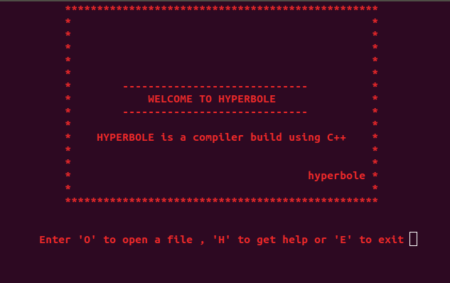

Hyperbole is a complete programming environment for a custom language (.hyp files), built entirely in C++. It includes an interpreter, IDE shell, and comprehensive help system.



## Key Features

* **Custom Language**: Unique syntax and semantics designed from scratch
* **Interactive IDE**: Built-in shell for writing and executing code
* **Source Code Handler**: Parse and manage .hyp source files
* **Help System**: Interactive documentation for language keywords
* **Execution Engine**: Interpret and run Hyperbole programs
* **Variable Management**: Memory management and variable storage
* **Loop Support**: Control flow with loops and conditionals

## Components

### IDE Shell

Interactive terminal interface for writing code, opening files, and executing programs. Features command history and syntax assistance.

### Source Code Handler

Reads and parses .hyp files, managing the source code lifecycle from loading to execution.

### Help System

Context-aware help for language keywords, operators, and syntax. View documentation without leaving the IDE.

### Execution Engine

Interprets Hyperbole code line-by-line, managing program flow and state.

### Language Logic Unit (ALGO)

Core logic for processing language constructs, operations, and control flow.

### Variable Store

Memory management system for storing and retrieving variables during program execution.

## Tech Stack

* **Language**: C++ 100%
* **Compiler**: Code::Blocks or any C++ compiler
* **Design**: Object-oriented with clean separation of concerns

## Example Features

```python
# Variable declarations
set x = 10
set y = 20

# Conditionals
check x < y then
    print "x is less than y"
end

# Loops
loop 5 times
    print "Hello"
end
```

This project demonstrates compiler design principles, including lexical analysis, parsing, interpretation, and memory management - all implemented from first principles in C++.
